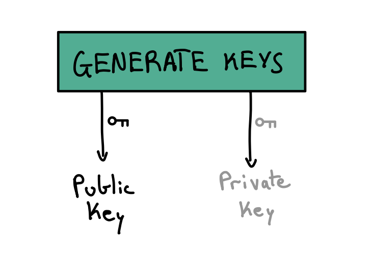
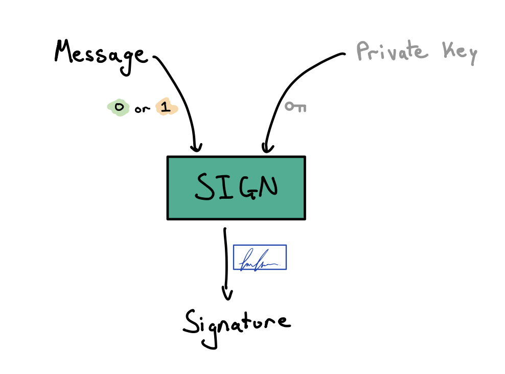
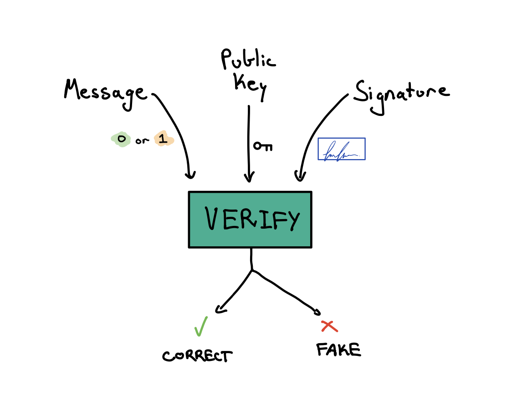

# Lamport Signatures (one-time signatures)

Lamport Signatures are a digital signature scheme that uses a one-way function (hash function) to generate a signature. This is a one-time signature scheme, meaning that the same message cannot be signed twice. See [wikipedia](https://en.wikipedia.org/wiki/Lamport_signature) for more information.

Lamport signatures are interesting as they are assumed to be secure against quantum computers. This is because the one-way function used is a hash function, which is assumed to be secure against quantum computers.

These notebooks are used for my own learning and are not intended to be a complete reference. They are based on the original paper by Lamport.

## **Notebooks**

- [Single Bit Signing](single_bit_signature.ipynb): Simple example of signing a single bit message
- [Naive Lamport Signatures](naive_lamport_signature.ipynb): A basic implementation of the original Lamport Signatures paper with uncompressed public and private keys
- [Short Private Keys](short_private_key_signature.ipynb): Lamport Signatures with a short private key (48 bytes) by using a CSPRNG to generate the private key instead of random bits
- [Short Public Keys](short_public_key_signature.ipynb): Lamport Signatures with a short public key (32 bytes) by using a vector commitment (Merkle root) instead of the full public key

## **Interface for all implementations**

### Generate a Keypair

### Sign a Message

### Verify a Message

**References**:

- [Original Lamport Signatures Paper](https://www.microsoft.com/en-us/research/publication/2016/12/Constructing-Digital-Signatures-from-a-One-Way-Function.pdf)
  <!-- - [Fast Accumulated Hashing Paper](https://link.springer.com/content/pdf/10.1007/3-540-60865-6_45.pdf?pdf=inline%20link) -->
  <!-- TODO: see if Fast Accumulated Hashing Paper is actually useful -->

<!-- @article{lamport1979constructing,
title={Constructing digital signatures from a one way function},
author={Lamport, Leslie},
year={1979}
} -->
